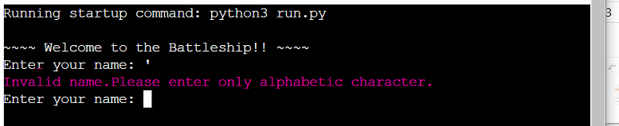
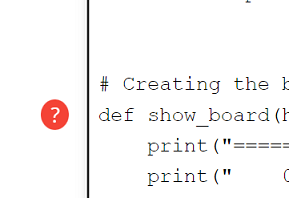

# Battleship Game

A strategic board game played by one player. In this case, this game will be played by guessing randomly hidden ships. The program allows you to guess by row and column.The aim is to find 3 ships using your 20 chances.This game is made with simple python language.

Here is a live link to the game :- https://the-battleship-86d41ee5519e.herokuapp.com/

# Table of contents
1. [Battleship Game](#battleship-game)
2. [How to play](#how-to-play)
3. [User Stories](#user-stories)
    * [User goals](#user-goals)
4. [Features](#features)
    * [Existing Features](#existing-features)
    * [Future Features](#future-features)
5. [Language used](#languages-used)
6. [Testing](#testing)
    * [Solved Bugs](#solved-bugs)
    * [Validator testing](#validator-testing)
7. [Deployment](#deployment)
8. [Credits](#credits)
    * [Content](#content)
    * [Code Used](#code-used)

## How to play

- The rules of the game are fairly simple. It begins by asking the player to choose a username and their board is created.
- The user will select a row and column from 0 - 9. After both a valid row and column are entered by the user, a sign is displayed on the board depending on whether or not their guess was correct. If the user managed to hit a ship successfully, they are told their guess was correct by seeing "X" displayed on the board which corresponds with the row and column selected by the user.
- If their guess was incorrect, however "O" is displayed on the board. If the user happens to select a row or column outside of that range or enter an unrecognized key, they will be given an error message and asked to type in a valid row.

- The player has a total of 3 ships to sink on the board. Once they run out of rounds and not total of 3 ships are hit, they are presented with a game-over message and the game ends. 

- If the user successfully manages to guess the correct position of all ships, however, then they are presented with an congratulatory message and told they have sunk all ships.

## User stories
A simple and fun game to play.
Easy to understand the structure of the webpage. 

#### User goals
To play a fun game.
To  play a game that is easy to navigate and understand.

## Features

### Existing Features

#### Welcome text
When "run program" is pressed,the player is asked for the their name for the game to start.

#### Invalid Text
When player inputs other character which is not alphabetic.

#### Rule Area
The rule will be visible after entering name.Its short and brief and it won't repeated.

#### Board Area
The board area is increased in number compared to my old game.

#### Row and Column Text
After entering name the user is asked a row and then column,which is one digit answer.The choice is from 0 to 9 and repeatative digits are not accepted.

#### Losing/winning

An end text will appear when the game is done.It depends on if you are winning or losing.Here is an example of losing.

### Future Features
- To set a break for best out of five.
- To be able to start over without pressing run program.
- To have players board. 

## Languages Used
- The whole game is solely made by python. 

## Testing

### Solved bugs
 
- Fixed invalid name that it won't accept signs or numbers. Defined "is_valid_name" so that it will only accept alphabets.

- The losing text was appearing though the game wasn't over.Checked the indentations and reduced the whitespace.

### Validator testing
- Used PEP8 to test the code.All it gave me back was white space and spaces between the funtion.

- Used this website :- https://www.pythonchecker.com/

## Deploying to Heroku
1. Go to [Heroku](https://id.heroku.com/login), create account if you don't have and log in.

- Head to your dashboard and click "New", then "Create new app"
- New/CreateNewApp
    
3. Next step is to give your app a name and to choose region. After that click on "Create app".

- Name/Region/Create
    
4. After that head to "Settings" tab which you can find on top of your Heroku page.

5. Then in the "Buildpacks" section you will need to add buildpacks. Pay attention to the order in which you add buildpacks you need. In my case I had to add Python first and nodejs second.

6. First add "Python", by clicking on Python icon and then click on "Add Buildpack".

7. Then add "nodejs", by clicking on nodejs icon and then click on "Add Buildpack".

8. Then head to "Deployment" tab which you can also find on top of your Heroku page and under "Deployment method" click on "GitHub"(in my case that's where my repository is).

9. After that, just under the "Deployment method" section is "Connect to GitHub" section where you need to find your repository and then click on "Connect".

10. Just under "Connect to GitHub" section is "Automatic deploys" section where you can click on "Enable Automatic Deploys" if that's what you want and just under is "Manual Deploy" section, where you need to click on "Deploy Manually".

## Credits
- My sister Nazret for supporting me through the whole process.

- AleksandarJavorovic in github for the README content.

- "Love Sandwiches" project for inspirtation and Should me how to deploy the game with Heroku.

- Google to being my building block.

#### Content
Written by Samrawit Tekheste.

#### Code Used
Inspiration for the program came from youtube tutorials that I have watched and other students projects from code insistute.This is a resubmission the old project used to accept signs or numbers.
So this is fixed version of my old game with a bigger board.

- Previous game link:- https://thebattleship-7ec99083b645.herokuapp.com/
- Previous github link :- https://github.com/Sammy92dec/The-battleship.git